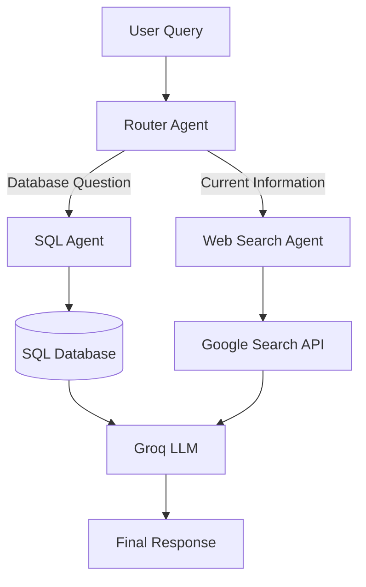
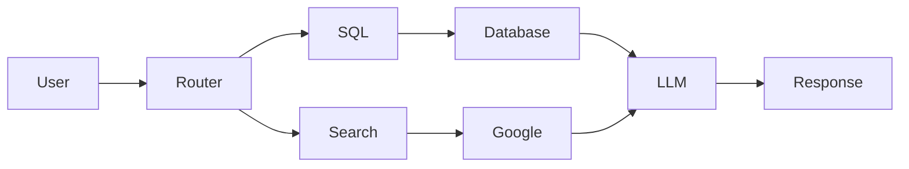
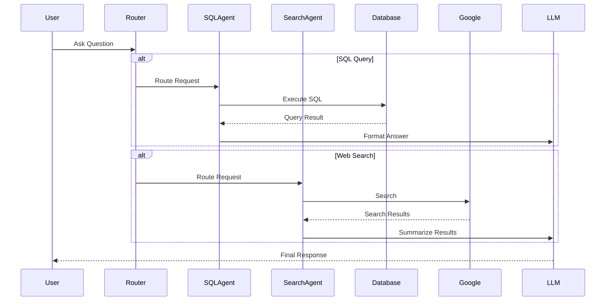

# 🤖 AI Agents: SQL Agent & Web Search Agent

<p align="center">


</p>

---

# 📖 Overview

AI Agents is a multi-agent application that intelligently routes user queries to the appropriate tool using **LangGraph**.

The system consists of:

- 🌐 **Web Search Agent** – Retrieves real-time information from Google Search.
- 🗄️ **SQL Agent** – Converts natural language into SQL queries to interact with relational databases.
- 🧠 **Conversation Memory** – Maintains chat history for contextual follow-up questions.
- 🔀 **Router Agent** – Determines whether a user's request requires database access or web search.

This architecture demonstrates how multiple specialized AI agents can collaborate to solve different types of user queries while providing a seamless conversational experience.

---

# ✨ Features

- 🤖 Multi-Agent Architecture
- 🔀 Intelligent Query Routing
- 🌐 Real-Time Web Search
- 🗄️ Natural Language to SQL
- 💬 Conversational Memory
- ⚡ High-Speed Responses using Groq LLM
- 📊 Structured Database Querying
- 🖥️ Streamlit User Interface
- 🔄 LangGraph Stateful Workflows

---

# 🏗️ System Architecture



---

# 🔄 Agent Workflow



---

# 💬 Conversation Flow



---

# 🛠️ Tech Stack

| Category | Technology |
|-----------|------------|
| Language | Python |
| Framework | LangChain |
| Workflow Engine | LangGraph |
| LLM | Groq |
| Search Tool | Google Search / Serper API |
| Database | SQL (SQLite / MySQL) |
| ORM | SQLAlchemy |
| UI | Streamlit |
| Environment | Python Virtual Environment |

---


---

# ⚙️ Installation

Clone the repository

```bash
git clone https://github.com/yourusername/langchain-ai-agents.git

cd langchain-ai-agents
```

Create a virtual environment

```bash
python -m venv venv
```

Activate the environment

### Windows

```bash
venv\Scripts\activate
```

### Linux / macOS

```bash
source venv/bin/activate
```

Install dependencies

```bash
pip install -r requirements.txt
```

---

# 🔑 Environment Variables

Create a `.env` file

```text
GROQ_API_KEY=

GOOGLE_API_KEY=

SERPER_API_KEY=
```

---

# ▶️ Run the Application

```bash
streamlit run app.py
```

---

# 💡 How It Works

### 1️⃣ User asks a question

↓

### 2️⃣ Router Agent analyzes the request

↓

### 3️⃣ Determines whether the query requires

- SQL Database
- Web Search

↓

### 4️⃣ Selected Agent performs the task

↓

### 5️⃣ Results are sent to Groq LLM

↓

### 6️⃣ LLM generates a natural language response

↓

### 7️⃣ Response is displayed to the user

---

# 📸 Screenshots

## 🏠 Home Page

> Replace with:

```
images/home.png
```

---

## 🗄️ SQL Agent

> Example:

```
images/sql_agent.png
```

---

## 🌐 Web Search Agent

> Example:

```
images/search_agent.png
```

---

## 🔀 Router Decision

> Example:

```
images/router.png
```

---

# 🎥 Demo

Replace with

```
images/demo.gif
```

---

# 🧪 Sample Questions

### SQL Agent

```
Show all employees earning more than ₹50,000.

List all customers from Bangalore.

How many products are available?

Display the top 5 highest-paid employees.
```

---

### Web Search Agent

```
Latest AI news

Current Bitcoin price

Today's weather in Bangalore

Who won the latest Wimbledon title?
```

---

### Memory Example

```
Who is the CEO of Microsoft?

Where was he born?

When did he become CEO?
```

The assistant understands follow-up questions using conversational memory.

---

# 🚀 Future Improvements

- Multi-Agent Collaboration
- Vector Database Integration
- PDF Agent
- CSV Agent
- Code Execution Agent
- Tool Calling Support
- Voice Assistant
- Authentication
- Docker Deployment
- Cloud Deployment

---

# 📈 Learning Outcomes

This project demonstrates practical experience with:

- AI Agent Design
- LangChain Agents
- LangGraph Stateful Workflows
- Tool Calling
- SQL Query Generation
- Retrieval of Real-Time Information
- Prompt Engineering
- LLM Orchestration
- Multi-Agent Systems
- Conversational Memory

---

# 🤝 Contributing

Contributions are welcome.

1. Fork the repository
2. Create a feature branch
3. Commit your changes
4. Submit a Pull Request

---

# 📄 License

This project is licensed under the MIT License.

---

# 👨‍💻 Author

**Uttam N**

Final Year Computer Science (Cyber Security)

Interested in:

- Software Engineering
- Artificial Intelligence
- Generative AI
- Agentic AI
- Large Language Models

LinkedIn: *(Add your profile)*

GitHub: *(Add your profile)*

---

## ⭐ If you found this project useful, consider giving it a star!
